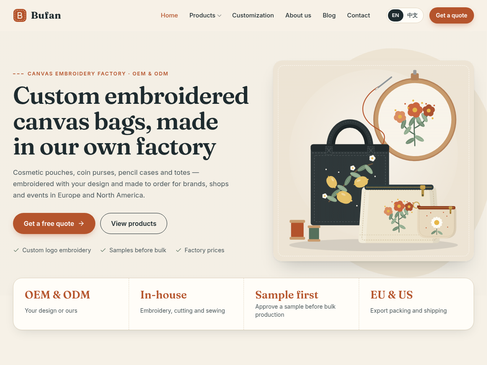

# Bufan 独立站（WordPress 主题）

这是给 **Bufan 帆布刺绣包工厂** 做的 B2B 外贸独立站，域名 **bufanfactory.com**。

它是一个 WordPress 主题，装好后就是一个完整的网站：

- **产品中心**：在后台自己上传产品，填写尺寸、材质、起订量、打样时间等参数，可以传多张图片
- **询盘表单**：客户在网站上提交询价后，询盘保存在后台的“询盘”菜单里，同时发邮件通知你
- **中英双语**：英文给欧美客户看（主语言），中文版在 `bufanfactory.com/zh/`，右上角一键切换
- **一键设置**：自动创建首页、定制服务、关于我们、常见问题、联系我们、隐私政策、博客等页面和菜单，以及 4 个示例产品
- **WhatsApp 按钮**：每个页面右下角都有 WhatsApp 聊天按钮，产品页也能直接用 WhatsApp 询价
- 自适应手机、加载快、内置 SEO 基础（多语言 hreflang、网站地图）



---

## WordPress 要钱吗？

**WordPress 软件本身是免费的**（开源软件，来自 wordpress.org）。这个主题和需要用到的插件也都是免费的。

你真正需要花钱的只有：

| 项目 | 费用 | 说明 |
|---|---|---|
| WordPress 软件 | 免费 | |
| Bufan 主题（本仓库） | 免费 | |
| Polylang 双语插件 | 免费 | 免费版就够用 |
| 域名 bufanfactory.com | 已经有了 | 每年续费 |
| **主机（服务器）** | 大约每月几美元到二三十美元 | 网站文件放在这里，**这是唯一必须新买的** |
| 企业邮箱（推荐） | 免费到每月几美元 | 比如 sales@bufanfactory.com |

> 注意区分：**wordpress.org** 是免费软件，自己找主机安装；**wordpress.com** 是另一家公司的托管服务，要按套餐付费，而且免费套餐不能装主题和插件。我们用的是前者。

---

## 上线步骤（第一次做，大约半天）

### 第 1 步：买主机

选一家支持“一键安装 WordPress”的海外主机，比如 SiteGround、Hostinger、Cloudways 等。

- **机房选美国或欧洲**，欧美客户打开更快，也不需要在国内备案
- 入门套餐就够用。首年通常有优惠，续费价格会更高，购买时留意续费价
- 确认套餐包含**免费 SSL 证书**（网址前面有小锁，https）

### 第 2 步：把域名指向主机

在你买域名的地方（域名注册商）修改 DNS，把 bufanfactory.com 指向新主机。主机商后台一般会告诉你要填的 **Nameserver** 或 **A 记录**，照着填就行。生效需要几分钟到几小时。

### 第 3 步：安装 WordPress

在主机后台找到“一键安装 WordPress”，填写网站名称、管理员用户名和密码（**密码要复杂，并记好**）。
安装完成后，用 `bufanfactory.com/wp-admin` 登录后台。

建议把后台改成中文：**Settings（设置）→ General（常规）→ Site Language（站点语言）→ 简体中文**，保存。
（网站前台的语言由 Polylang 控制，英文版仍然是英文，不受影响。）

### 第 4 步：安装主题

1. 下载主题文件 **[`dist/bufan.zip`](dist/bufan.zip)**（不要解压）
2. 后台 **外观 → 主题 → 安装主题 → 上传主题**，选择 `bufan.zip`，点“立即安装”
3. 安装后点 **启用**

### 第 5 步：安装 Polylang 双语插件

1. 后台 **插件 → 安装插件**，搜索 **Polylang**
2. 找到作者是 WP SYNTEX 的 Polylang，点“立即安装”，再点“启用”
3. 如果自动弹出 Polylang 自己的设置向导，**可以直接关掉**，下一步会自动配置好语言

### 第 6 步：运行一键设置

后台左侧菜单 **Bufan → 一键设置**，点 **开始设置**。几秒钟后会自动创建：

- 语言：英文（主语言）+ 中文
- 页面：首页、定制服务、关于我们、常见问题、联系我们、隐私政策、博客（中英文各一套）
- 产品分类：化妆包、零钱包、笔袋、托特包（中英文）
- 4 个示例产品（带插图）和中英文菜单

点“查看网站”，网站就已经可以访问了。

### 第 7 步：填写公司信息

后台 **Bufan → 设置**，填写：

- **Logo**（透明背景的 PNG 最好）
- **对外邮箱**：显示在网站上
- **询盘通知发送到**：新询盘发到这个邮箱
- **WhatsApp 号码**：带国家区号，例如 `+86 138 0000 0000`
- 电话、微信号、工厂地址（中英文）、营业时间
- Instagram / Facebook / Pinterest / LinkedIn 等社交账号（有就填）

### 第 8 步：确保能收到询盘邮件（很重要）

很多主机默认发不出邮件，或者邮件进垃圾箱。安装免费插件 **WP Mail SMTP**，按它的向导用你的企业邮箱（Zoho、Google Workspace、腾讯企业邮等）配置好，然后用它的“发送测试邮件”试一下。

即使邮件没发出去，询盘也不会丢：后台 **询盘** 菜单里都能看到，发送失败的会标红提示。

---

## 日常使用

### 上新产品

1. **产品中心 → 添加新产品**
2. 填 **标题** 和 **详细介绍**（编辑器里）
3. 右侧 **产品主图**：设置一张主图（建议正方形，至少 1000×1000 像素）
4. 下方 **产品详情**：
   - **产品图片**：添加更多角度的图片、细节图，可拖动排序
   - **规格参数**：货号、尺寸、材质、颜色、刺绣工艺、起订量、打样时间、大货交期、包装。**没有的留空，网站上就不显示**
   - **更多参数**：每行一条，比如 `拉链: YKK 5 号金属拉链`
   - **可定制项目**：每行一项，在产品页显示成打勾清单
   - **首页**：勾选后会出现在首页“热门款式”里
5. 下方 **摘要**：一两句话的简介，显示在产品标题下面
6. 右侧选择 **产品分类**，点 **发布**

### 给产品加中文版

英文版发布后，在右侧 **Languages（语言）** 框里，中文国旗旁边点 **“+”**：

- 会打开一个新的产品编辑页，**图片、参数、分类都已自动从英文版复制过来**
- 只需要把标题、介绍、参数里的文字改成中文，然后发布
- 之后改图片、货号、首页推荐，中英文会自动同步；文字可以分别修改

> 欧美客户只看英文版，中文版不是必须的。时间紧可以先只发英文。

### 查看和回复询盘

- 后台 **询盘** 菜单，有新询盘时菜单旁会显示红色数字
- 点开可以看到客户的姓名、邮箱、公司、国家、电话、数量、留言，以及是从哪个产品页发来的
- 右侧按钮可以 **直接用邮件回复** 或 **在 WhatsApp 中打开**

### 修改首页

**页面 → 首页 → 编辑**（中文首页是“首页”那一篇中文页面）：

- 编辑器里的正文 → 显示在首页“关于我们”区域
- 下方 **首页内容设置**：大标题、介绍文字、大图、4 个“工厂亮点”格子、“关于我们”标题和工厂照片

**一定要换成真实信息**：比如“15 年刺绣经验”“60 台刺绣机”“月产 10 万个”“起订量 100 个”，真实的数字最能打动买家。

### 修改其他页面

**页面** 里可以修改“关于我们”“定制服务”“常见问题”“隐私政策”。一键设置生成的是通用文字，**请务必改成你们的真实情况**：

- 关于我们：工厂历史、规模、团队、车间照片
- 定制服务：删掉你们做不了的刺绣工艺，补充你们的特色
- 常见问题：填上真实的起订量、打样费、交期、付款方式
- 隐私政策：说明网站如何使用客户信息。欧盟客户比较看重，内容按你们的实际情况检查一下

### 修改菜单

**外观 → 菜单**：每种语言各有一个主菜单和页脚菜单，可以增删和调整顺序。

### 删除示例产品

4 个示例产品用的是插图和示例参数，**上真实产品后请删除或改掉**（产品中心 → 移至回收站）。

---

## 推荐的免费插件

| 插件 | 用途 |
|---|---|
| **Polylang** | 中英双语（必装） |
| **WP Mail SMTP** | 确保询盘邮件能发出去（强烈推荐） |
| **Yoast SEO** | 设置每个页面的 Google 搜索标题和描述，和 Polylang 兼容 |
| **UpdraftPlus** | 自动备份网站，可以备份到 Google Drive / Dropbox |
| 缓存插件 | 主机自带的优先（比如 LiteSpeed Cache、SG Optimizer），没有就用 WP Super Cache。询盘表单支持页面缓存 |

---

## 图片建议

- 产品图用**正方形**（1:1），至少 1000×1000 像素，白底或浅色背景
- 上传前压缩一下（比如用 tinypng.com 或 squoosh.app），单张最好在 300KB 以内，网站打开更快
- 首页大图、工厂照片、车间视频截图一定用**真实照片**，这是证明你是工厂最有力的东西

---

## 常见问题

**询盘收不到邮件？**
先看后台“询盘”里有没有。有的话说明是邮件发送问题，装 WP Mail SMTP 配置企业邮箱。

**想改网站上固定的文字（比如“为什么选择 Bufan”这类标题）？**
这些文字写在主题里。可以装 **Loco Translate** 插件修改，或者告诉我要改成什么，我来改主题。

**中文网址是什么？**
英文首页 `bufanfactory.com`，中文首页 `bufanfactory.com/zh/`，所有中文页面都在 `/zh/` 下面。

**以后主题更新怎么装？**
下载新的 `bufan.zip`，**外观 → 主题 → 安装主题 → 上传主题**，选择“用上传的版本替换当前版本”。产品、询盘、页面内容都不会丢。

---

## 技术说明（给开发者）

```
bufan/                    WordPress 主题
├── functions.php         入口
├── inc/
│   ├── products.php      产品文章类型 bufan_product、分类 bufan_product_cat、参数字段、图片集
│   ├── inquiries.php     询盘表单处理、邮件通知、后台询盘列表（bufan_inquiry）
│   ├── settings.php      Bufan → 设置（选项 bufan_settings）
│   ├── home-fields.php   首页字段（存在首页的 post meta 里，中英文各自独立）
│   ├── polylang.php      Polylang 集成：产品/分类可翻译、翻译时复制字段、语言切换
│   ├── setup-wizard.php  一键设置
│   ├── starter-content.php 中英文示例内容
│   ├── template-tags.php 模板函数
│   └── icons.php         内联 SVG 图标（Lucide / Simple Icons）
├── template-parts/       产品卡片、询盘表单、流程、页头等
├── page-templates/       联系页、定制服务页模板
├── assets/               CSS、JS、自托管字体（Fraunces、Inter，SIL OFL）、插图
└── languages/            zh_CN 翻译（.po 源文件，.mo / .l10n.php 已编译）
tools/build.sh            重新编译翻译并打包 dist/bufan.zip
dist/bufan.zip            可直接上传到 WordPress 的主题包
```

- 要求：WordPress 6.5+（已在 7.1 测试），PHP 7.4+，Polylang 3.7+
- 询盘表单不用 nonce（避免页面缓存导致过期），用签名时间戳、蜜罐字段和按 IP 限流防垃圾
- 产品和首页使用经典编辑器，其余页面使用区块编辑器
- 修改界面文字后运行 `tools/build.sh`（需要 WP-CLI）更新翻译并重新打包
